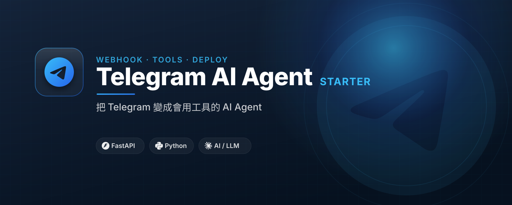

# Telegram AI Agent Starter

Build a Telegram AI assistant that can call LLMs and tools.

## 繁中定位

**Telegram AI Agent 入門模板** 面向台灣繁中受眾。

- 主要受眾：適合想把 Telegram 變成 AI 工作入口的台灣工程師、接案者與小團隊。
- 核心承諾：從一個 bot token 開始，做出會回覆、會呼叫工具、可部署的 AI Agent。
- CTA 頁：https://yazelin.github.io/telegram-ai-agent-starter/


## 公開教學文件

這個 repo 的教學內容直接公開，讓你可以先自己照著跑；如果需要手把手 debug、改成你的公司或個人場景，再考慮工作坊或顧問協助。

- 網頁版教學：https://yazelin.github.io/telegram-ai-agent-starter/tutorial.html
- Markdown 教學：[`docs/`](docs/)
- 快速開始：[`docs/01-quickstart.md`](docs/01-quickstart.md)
- 常見踩雷：[`docs/05-common-pitfalls.md`](docs/05-common-pitfalls.md)
- 後半段(PydanticAI 對照組):docs/08-pydantic-ai-agent.md

## Who this is for

Engineers who want a deployable Telegram AI workflow bot.

## Features

- FastAPI webhook（`POST /webhook/telegram`）+ polling dev mode（`uv run python -m app.polling`，含錯誤退避）
- 四種 `AI_PROVIDER`：`echo`（離線純對話）/ `claude-cli` / `gemini-cli`（純對話）/ `http`（OpenAI-compatible）
- **真正的 tool-calling agent 迴圈（僅 `http` 模式）**：把 `tools=` 送給 LLM，模型自己決定呼叫 `app/tools.py` 的工具，結果接回對話再產生最終答案；其他三種 provider 為純 chat
- 手動 `/tool time` 指令隨時可用；Allow-list user IDs 擋陌生人
- Docker-ready starter for workshops
- PydanticAI agent 版同功能重寫(optional `pydantic` extra)— 見 `docs/08-pydantic-ai-agent.md`

## Quick start

本專案用 [uv](https://docs.astral.sh/uv/) 管理依賴與虛擬環境（取代 venv + pip）。

安裝 uv（一次就好）：

- Ubuntu / macOS：

  ```bash
  curl -LsSf https://astral.sh/uv/install.sh | sh
  ```

- Windows（PowerShell）：

  ```powershell
  powershell -ExecutionPolicy ByPass -c "irm https://astral.sh/uv/install.ps1 | iex"
  ```

裝完重開終端機，`uv --version` 印得出版本就 OK。

取得專案、裝依賴、跑起來：

```bash
git clone https://github.com/yazelin/telegram-ai-agent-starter.git
cd telegram-ai-agent-starter
uv sync
cp .env.example .env
uv run uvicorn app.main:app --reload --port 8000
```

`uv sync` 會依 `pyproject.toml` + `uv.lock` 自動建立 `.venv` 並裝好套件（毋須手動 venv/activate）；`uv run` 直接在那個環境裡執行。**以上 `uv sync` / `uv run` 在 Ubuntu 與 Windows 完全相同。** 加新套件用 `uv add <套件>`。

本機 polling 開發模式（不需公開網址）：`uv run python -m app.polling`。

（沒裝 uv 的話 `pip install .` 也能裝，但本教學以 uv 為主。）

See the source files and `.env.example` for the minimal runnable path.

### 後半段:PydanticAI agent 版(對照組)

```bash
uv sync --extra pydantic
PYTHONPATH=. uv run python agent_smoke_test_pydantic.py   # 框架接線 smoke(免 API key)
# .env 設 AI_PROVIDER=pydantic 後:
uv run uvicorn app.main:app                               # bot 改用 PydanticAI agent
```

## Learn / get help

This repo is also a CTA page for workshops and consulting:

- GitHub Pages: https://yazelin.github.io/telegram-ai-agent-starter/
- Contact: yazelin@ching-tech.com

## License

MIT


## Brand / CTA design

- Landing page: https://yazelin.github.io/telegram-ai-agent-starter/
- CI spec: [DESIGN.md](DESIGN.md)
- Banner: [assets/banner.svg](assets/banner.svg)
- Logo: [assets/logo.svg](assets/logo.svg)

---
## 關於作者

這個範本由 **林亞澤（Yaze Lin）** 維護 — 出身機電自動化系統整合，現在把同一套工程方法用在 AI 產品上。

- 任職於 **擎添工業 ChingTech**（1984 年成立的機電自動化公司：PLC 程式、機械手臂、AGV 無人搬運、半導體封測／PCB／面板／光學產線整合）。
- 技術筆記與更多範例：[yazelin.github.io](https://yazelin.github.io) · GitHub [@yazelin](https://github.com/yazelin)

## 從範本到正式產品

> 把「會自己呼叫工具的 agent」做到正式產品這條線，我們做成了 AgentOS 與 Mori Desktop。

如果你想看同樣的想法做成正式、上線中的產品：

- **CTOS** — 企業 AI 工作平台：macOS 風格 Web 桌面、知識庫 RAG 檢索、產業專屬 Agent、LINE Bot 整合，資料留在台灣。[ching-tech.com](https://ching-tech.com) · [品牌站](https://ching-tech.github.io)
- **CTOS-Lite / CT JINN** — 把公司裝進 LINE 的個人版 AI 助理，加 LINE 即可試用：[@285fjkky](https://line.me/R/ti/p/@285fjkky)
- **Mori Desktop** — 個人 AI 管家桌面應用（Tauri 2 + Rust + React）：[github.com/yazelin/mori-desktop](https://github.com/yazelin/mori-desktop)
- **AgentOS** — 跨 CLI 的 agent 治理平台（開發中）

> 想把這個範本落地成你公司的內部系統，或想上一堂從 0 到部署的課？
> 來信 yazelin@ching-tech.com，或追蹤上面的連結。
